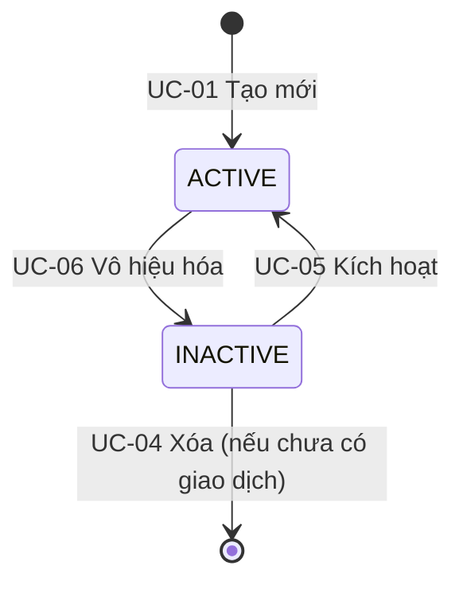
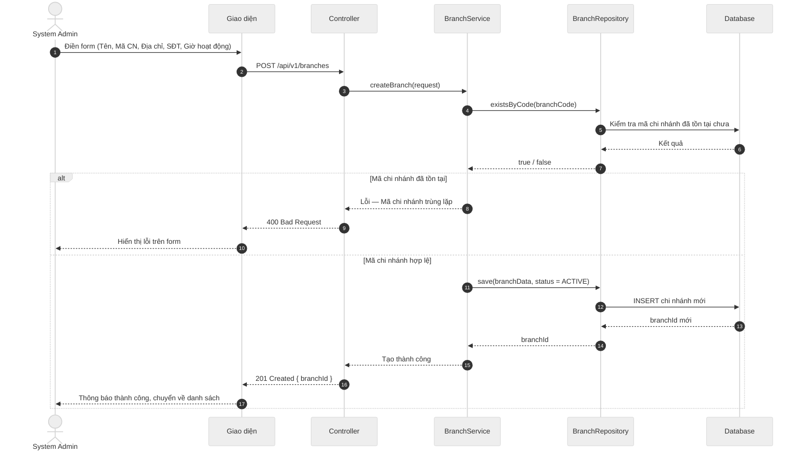
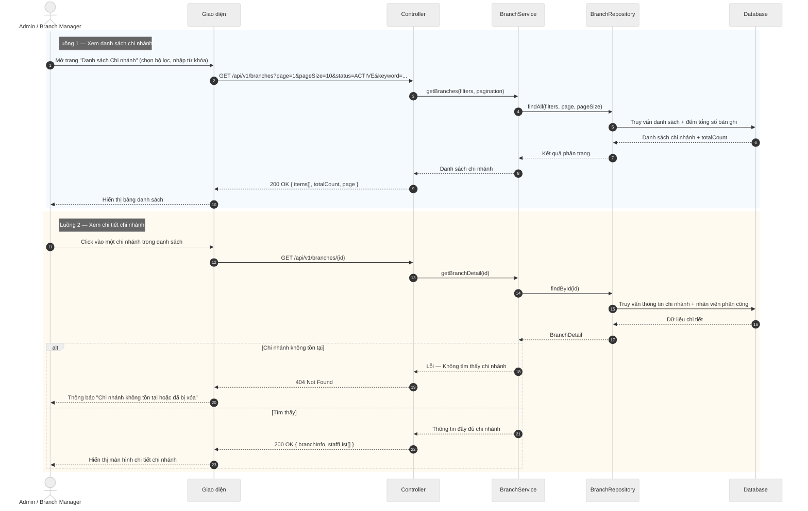
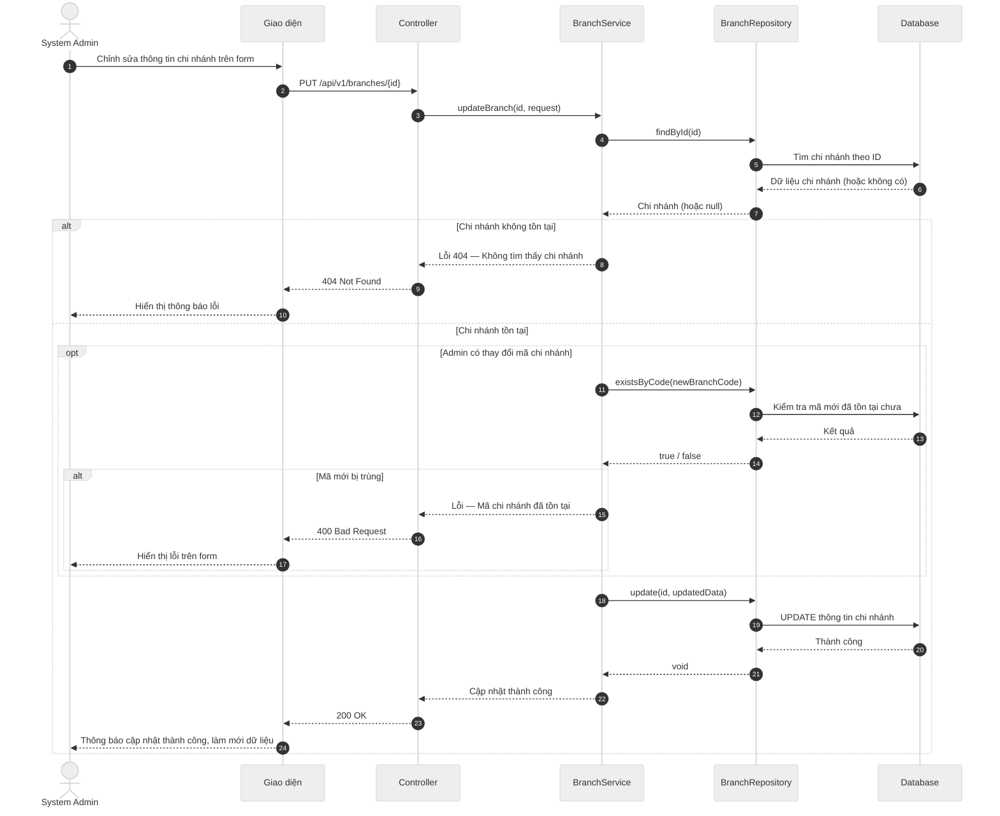
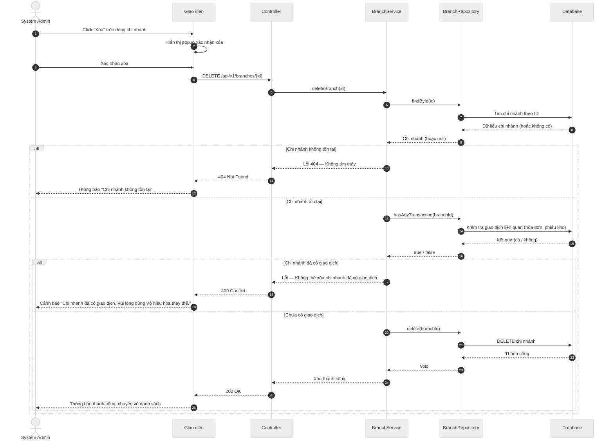
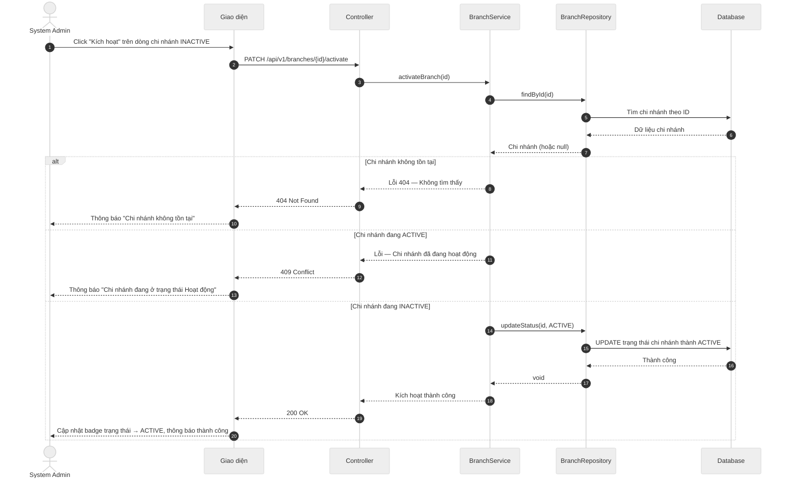
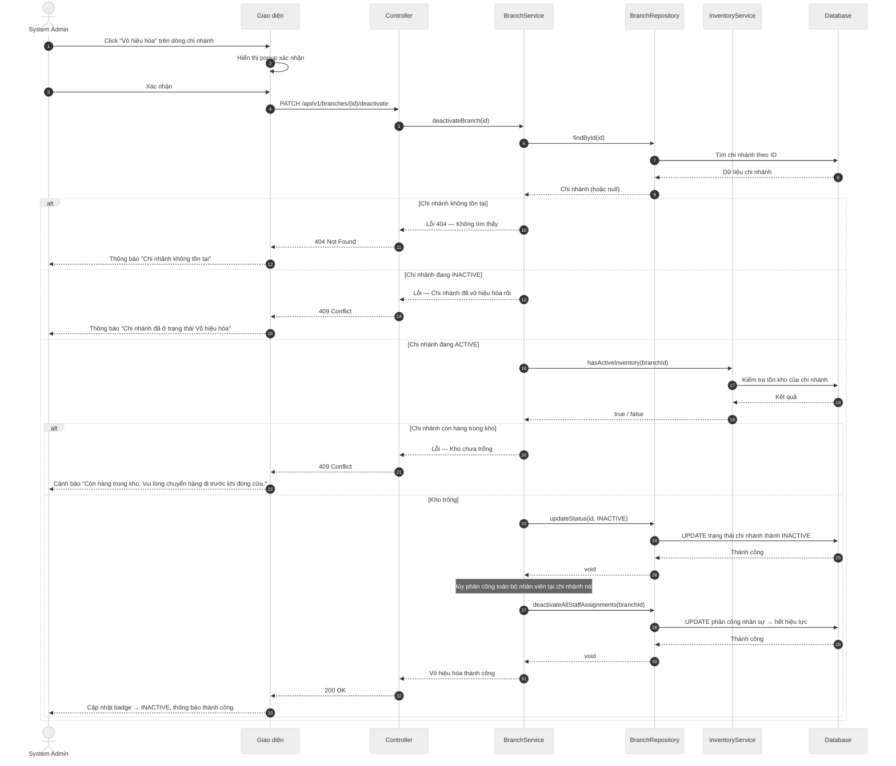

# Tài liệu Nghiệp vụ: Quản lý Chi nhánh (Branch Management)

> **Phạm vi tài liệu:** Mô tả 6 nghiệp vụ cốt lõi của module Quản lý Chi nhánh theo góc nhìn kinh doanh.  
> Mỗi use case được trình bày theo thứ tự: **Mô tả → Tiền điều kiện → Đầu vào → Đầu ra → Sơ đồ tuần tự**.

---

## 1. Tác nhân (Actors)

| Tác nhân | Mô tả vai trò |
|---|---|
| **System Admin** | Quản trị viên hệ thống — có toàn quyền tạo, chỉnh sửa, xóa và thay đổi trạng thái bất kỳ chi nhánh nào. |
| **Branch Manager** | Quản lý chi nhánh — chỉ có quyền xem thông tin của chi nhánh mình đang phụ trách. |

---

## 2. Danh sách Use Case

| Mã | Tên Use Case | Tác nhân | Mô tả ngắn |
|---|---|---|---|
| **UC-01** | Tạo mới chi nhánh | System Admin | Đăng ký một chi nhánh/cửa hàng mới vào hệ thống POS. |
| **UC-02** | Xem chi nhánh | System Admin, Branch Manager | Tra cứu danh sách hoặc xem toàn bộ thông tin chi tiết của một chi nhánh. |
| **UC-03** | Cập nhật thông tin chi nhánh | System Admin | Chỉnh sửa thông tin vận hành của chi nhánh (tên, địa chỉ, SĐT, giờ hoạt động). |
| **UC-04** | Xóa chi nhánh | System Admin | Xóa vĩnh viễn chi nhánh khỏi hệ thống (chỉ áp dụng khi chưa có bất kỳ giao dịch nào). |
| **UC-05** | Kích hoạt chi nhánh | System Admin | Mở lại chi nhánh đang bị vô hiệu hóa để tiếp tục nhận đơn hàng và giao dịch mới. |
| **UC-06** | Vô hiệu hóa chi nhánh | System Admin | Đóng cửa chi nhánh, ngừng toàn bộ giao dịch mới trong khi vẫn giữ nguyên lịch sử dữ liệu. |

---

## 3. Quy tắc Nghiệp vụ (Business Rules)

### BR-01 — Mã chi nhánh phải là duy nhất
Mỗi chi nhánh có một mã định danh riêng (Branch Code). Hệ thống từ chối tạo mới hoặc cập nhật nếu mã này đã được sử dụng bởi chi nhánh khác.

### BR-02 — Chi nhánh đã có giao dịch không được xóa vĩnh viễn
Khi chi nhánh đã phát sinh ít nhất một giao dịch (hóa đơn bán hàng, phiếu nhập/xuất kho), dữ liệu đó gắn liền với chi nhánh và không thể xóa để tránh mất liên kết. Trong trường hợp này, Admin phải sử dụng chức năng **Vô hiệu hóa** thay thế.

### BR-03 — Chi nhánh còn hàng trong kho không được vô hiệu hóa
Trước khi vô hiệu hóa, tất cả hàng hóa trong kho của chi nhánh phải được chuyển đi hoặc xử lý xong. Mục đích là tránh để hàng "treo" ở một chi nhánh đã đóng cửa.

### BR-04 — Chi nhánh vô hiệu hóa ẩn khỏi mọi giao dịch mới
Chi nhánh ở trạng thái **INACTIVE** sẽ không xuất hiện trong danh sách chọn chi nhánh khi nhân viên đăng nhập ca, khi khách đặt hàng, hay khi tạo phiếu nhập/xuất kho. Toàn bộ dữ liệu lịch sử (báo cáo doanh thu, hóa đơn cũ) vẫn hiển thị đầy đủ.

### BR-05 — Chỉ chi nhánh INACTIVE mới được kích hoạt lại
Chức năng **Kích hoạt** chỉ có ý nghĩa khi chi nhánh đang ở trạng thái **INACTIVE**. Chi nhánh đang hoạt động bình thường (ACTIVE) không cần và không thể thực hiện thao tác này.

---

## 4. Trạng thái vòng đời Chi nhánh



| Trạng thái | Ý nghĩa | Nhận đơn hàng mới? | Hiển thị trong báo cáo? |
|---|---|:---:|:---:|
| **ACTIVE** | Chi nhánh đang vận hành bình thường | ✔️ | ✔️ |
| **INACTIVE** | Chi nhánh đã đóng cửa, ngừng hoạt động | ✖️ | ✔️ (lịch sử) |

---

## 5. Chi tiết Use Case

---

### UC-01: Tạo mới Chi nhánh

#### Mô tả nghiệp vụ
System Admin đăng ký một cửa hàng/chi nhánh mới vào hệ thống POS. Sau khi tạo thành công, chi nhánh ngay lập tức ở trạng thái **ACTIVE** và sẵn sàng để nhân viên đăng nhập, nhập kho, và bắt đầu bán hàng.

Hệ thống kiểm tra mã chi nhánh trước khi lưu để đảm bảo không trùng lặp với bất kỳ chi nhánh nào đã tồn tại (kể cả chi nhánh đã bị vô hiệu hóa).

#### Tiền điều kiện
- Admin đã đăng nhập và có quyền quản trị hệ thống.

#### Đầu vào

| Trường | Bắt buộc | Mô tả |
|---|:---:|---|
| Tên chi nhánh | ✔️ | Tên hiển thị của cửa hàng (ví dụ: "Chi nhánh Quận 1") |
| Mã chi nhánh | ✔️ | Mã định danh ngắn, duy nhất trong hệ thống (ví dụ: "HCM-Q1") |
| Địa chỉ | ✔️ | Địa chỉ vật lý đầy đủ của chi nhánh |
| Số điện thoại | ✔️ | Hotline liên hệ của chi nhánh |
| Giờ mở cửa | ✔️ | Giờ bắt đầu nhận khách (ví dụ: 08:00) |
| Giờ đóng cửa | ✔️ | Giờ kết thúc nhận khách (ví dụ: 22:00) |

#### Đầu ra

| Kịch bản | Kết quả trả về |
|---|---|
| ✅ Tạo thành công | Chi nhánh mới được lưu với trạng thái **ACTIVE**. Hệ thống trả về ID chi nhánh vừa tạo. Giao diện chuyển về trang danh sách và hiển thị thông báo thành công. |
| ❌ Mã chi nhánh đã tồn tại | Hệ thống từ chối và hiển thị lỗi ngay trên form: *"Mã chi nhánh '[HCM-Q1]' đã được sử dụng. Vui lòng chọn mã khác."* |
| ❌ Thiếu thông tin bắt buộc | Hệ thống highlight trường bị thiếu và hiển thị thông báo yêu cầu điền đủ trước khi lưu. |

#### Sơ đồ tuần tự



---

### UC-02: Xem Chi nhánh

#### Mô tả nghiệp vụ
Cho phép Admin và Branch Manager tra cứu thông tin chi nhánh theo hai nhu cầu:

- **Xem danh sách:** Hiển thị tất cả chi nhánh dưới dạng bảng với khả năng lọc theo trạng thái và tìm kiếm theo tên/mã. Hỗ trợ phân trang để xử lý khi hệ thống có nhiều chi nhánh.
- **Xem chi tiết:** Khi click vào một chi nhánh cụ thể, hệ thống hiển thị toàn bộ thông tin bao gồm danh sách nhân viên đang được phân công tại chi nhánh đó.

Branch Manager chỉ được phép xem thông tin của chi nhánh mình đang phụ trách.

#### Tiền điều kiện
- Người dùng đã đăng nhập.
- Branch Manager chỉ xem được chi nhánh của mình.

#### Đầu vào

**Xem danh sách:**

| Trường | Bắt buộc | Mô tả |
|---|:---:|---|
| Trang hiện tại (page) | ✖️ | Mặc định là trang 1 |
| Số bản ghi mỗi trang (pageSize) | ✖️ | Mặc định 10 bản ghi |
| Lọc trạng thái | ✖️ | ACTIVE / INACTIVE / Tất cả (mặc định: Tất cả) |
| Từ khóa tìm kiếm | ✖️ | Tìm theo tên hoặc mã chi nhánh |

**Xem chi tiết:**

| Trường | Bắt buộc | Mô tả |
|---|:---:|---|
| ID chi nhánh | ✔️ | Lấy từ URL khi click vào dòng trong danh sách |

#### Đầu ra

**Xem danh sách:**

| Kịch bản | Kết quả trả về |
|---|---|
| ✅ Thành công | Danh sách chi nhánh gồm: Mã, Tên, Địa chỉ, SĐT, Trạng thái. Kèm tổng số bản ghi để phân trang. |
| ✅ Không có kết quả | Hiển thị bảng trống với thông báo *"Không tìm thấy chi nhánh nào phù hợp."* |

**Xem chi tiết:**

| Kịch bản | Kết quả trả về |
|---|---|
| ✅ Tìm thấy | Toàn bộ thông tin chi nhánh: Mã, Tên, Địa chỉ, SĐT, Giờ hoạt động, Trạng thái + Danh sách nhân viên đang phân công. |
| ❌ Không tìm thấy | Hệ thống trả về lỗi 404, giao diện hiển thị *"Chi nhánh không tồn tại hoặc đã bị xóa."* |

#### Sơ đồ tuần tự



---

### UC-03: Cập nhật Thông tin Chi nhánh

#### Mô tả nghiệp vụ
System Admin chỉnh sửa thông tin vận hành của một chi nhánh đang tồn tại trong hệ thống. Chức năng này thường được dùng khi chi nhánh thay đổi địa điểm, số điện thoại, giờ hoạt động, hoặc cần đổi tên hiển thị.

Nếu Admin thay đổi **mã chi nhánh**, hệ thống phải kiểm tra lại tính duy nhất của mã mới trước khi lưu. Nếu không thay đổi mã, bước kiểm tra này được bỏ qua để tránh thao tác thừa.

Chức năng này **không** cho phép thay đổi trạng thái chi nhánh (ACTIVE / INACTIVE). Việc thay đổi trạng thái được thực hiện qua UC-05 và UC-06.

#### Tiền điều kiện
- Chi nhánh cần cập nhật phải đang tồn tại trong hệ thống.
- Admin đã đăng nhập và có quyền quản trị.

#### Đầu vào

| Trường | Bắt buộc | Mô tả |
|---|:---:|---|
| ID chi nhánh | ✔️ | Xác định chi nhánh cần cập nhật (lấy từ URL) |
| Tên chi nhánh | ✖️ | Tên mới nếu cần thay đổi |
| Mã chi nhánh | ✖️ | Mã mới — hệ thống kiểm tra duy nhất nếu có thay đổi |
| Địa chỉ | ✖️ | Địa chỉ mới |
| Số điện thoại | ✖️ | Số điện thoại mới |
| Giờ mở cửa / đóng cửa | ✖️ | Cập nhật giờ hoạt động |

> Ít nhất một trường phải được thay đổi. Gửi request không có gì thay đổi sẽ bị từ chối.

#### Đầu ra

| Kịch bản | Kết quả trả về |
|---|---|
| ✅ Cập nhật thành công | Thông tin chi nhánh được lưu, giao diện hiển thị thông báo *"Cập nhật thành công"* và làm mới dữ liệu trên màn hình. |
| ❌ Chi nhánh không tồn tại | Hệ thống trả về lỗi 404: *"Chi nhánh không tồn tại hoặc đã bị xóa."* |
| ❌ Mã chi nhánh mới bị trùng | Hệ thống từ chối và hiển thị lỗi: *"Mã chi nhánh '[mã mới]' đã được sử dụng bởi chi nhánh khác."* |

#### Sơ đồ tuần tự



---

### UC-04: Xóa Chi nhánh

#### Mô tả nghiệp vụ
System Admin xóa vĩnh viễn một chi nhánh khỏi hệ thống. Thao tác này **không thể hoàn tác**.

Để bảo toàn tính toàn vẹn dữ liệu, hệ thống chỉ cho phép xóa chi nhánh khi chi nhánh đó **chưa phát sinh bất kỳ giao dịch nào** (hóa đơn bán hàng, phiếu nhập/xuất kho). Nếu chi nhánh đã có giao dịch, Admin bắt buộc phải dùng chức năng **Vô hiệu hóa (UC-06)** thay thế — vừa ngừng hoạt động chi nhánh, vừa giữ nguyên toàn bộ lịch sử.

Trước khi thực hiện, hệ thống hiển thị popup xác nhận để tránh xóa nhầm.

#### Tiền điều kiện
- Chi nhánh cần xóa phải đang tồn tại.
- Chi nhánh chưa có bất kỳ giao dịch nào (hóa đơn, phiếu kho).
- Admin đã đăng nhập và xác nhận thao tác trên popup cảnh báo.

#### Đầu vào

| Trường | Bắt buộc | Mô tả |
|---|:---:|---|
| ID chi nhánh | ✔️ | Chi nhánh cần xóa (lấy từ URL) |
| Xác nhận từ Admin | ✔️ | Admin bấm "Xác nhận" trên popup cảnh báo |

#### Đầu ra

| Kịch bản | Kết quả trả về |
|---|---|
| ✅ Xóa thành công | Chi nhánh bị xóa vĩnh viễn khỏi hệ thống. Giao diện chuyển về danh sách và hiển thị thông báo *"Đã xóa chi nhánh thành công."* |
| ❌ Chi nhánh không tồn tại | Hệ thống trả về lỗi 404. |
| ❌ Chi nhánh đã có giao dịch | Hệ thống từ chối xóa và hiển thị cảnh báo: *"Chi nhánh này đã có giao dịch trong hệ thống. Vui lòng sử dụng chức năng Vô hiệu hóa thay thế."* |

#### Sơ đồ tuần tự



---

### UC-05: Kích hoạt Chi nhánh

#### Mô tả nghiệp vụ
System Admin mở lại một chi nhánh đang bị vô hiệu hóa (trạng thái **INACTIVE**) để chi nhánh có thể tiếp tục vận hành bình thường: nhân viên đăng nhập ca, nhận đơn hàng mới, thực hiện nhập/xuất kho.

Kịch bản điển hình: Chi nhánh trước đó bị vô hiệu hóa để tạm đóng cửa (sửa chữa, tái cơ cấu) và nay sẵn sàng hoạt động trở lại.

Thao tác này chỉ áp dụng được khi chi nhánh đang ở trạng thái **INACTIVE**. Nếu chi nhánh đang **ACTIVE**, hệ thống từ chối và giải thích lý do.

#### Tiền điều kiện
- Chi nhánh đang ở trạng thái **INACTIVE**.
- Admin đã đăng nhập và có quyền quản trị.

#### Đầu vào

| Trường | Bắt buộc | Mô tả |
|---|:---:|---|
| ID chi nhánh | ✔️ | Chi nhánh cần kích hoạt lại |

#### Đầu ra

| Kịch bản | Kết quả trả về |
|---|---|
| ✅ Kích hoạt thành công | Chi nhánh chuyển sang trạng thái **ACTIVE**. Giao diện cập nhật badge trạng thái và hiển thị thông báo: *"Chi nhánh đã được kích hoạt thành công."* |
| ❌ Chi nhánh không tồn tại | Hệ thống trả về lỗi 404. |
| ❌ Chi nhánh đang ACTIVE | Hệ thống từ chối và thông báo: *"Chi nhánh này đang ở trạng thái Hoạt động. Không cần thực hiện kích hoạt lại."* |

#### Sơ đồ tuần tự



---

### UC-06: Vô hiệu hóa Chi nhánh

#### Mô tả nghiệp vụ
System Admin đóng cửa một chi nhánh đang hoạt động. Sau khi vô hiệu hóa, chi nhánh chuyển sang trạng thái **INACTIVE** và bị ẩn khỏi toàn bộ luồng giao dịch mới trong hệ thống.

Đây là thao tác **ưu tiên sử dụng** khi cần ngừng hoạt động một chi nhánh (thay vì xóa), vì toàn bộ lịch sử dữ liệu — hóa đơn, báo cáo doanh thu, phiếu kho — vẫn được giữ nguyên, đảm bảo tính liên tục cho công tác kế toán và kiểm toán.

Trước khi vô hiệu hóa, hệ thống bắt buộc kiểm tra kho hàng của chi nhánh. Nếu còn hàng tồn kho, Admin phải chuyển toàn bộ hàng đi trước — tránh để hàng hóa "mắc kẹt" tại một chi nhánh đã đóng cửa.

Sau khi vô hiệu hóa thành công, toàn bộ nhân viên đang được phân công tại chi nhánh sẽ tự động được gỡ phân công.

#### Tiền điều kiện
- Chi nhánh đang ở trạng thái **ACTIVE**.
- Kho hàng của chi nhánh phải trống (không còn tồn kho).
- Admin đã đăng nhập và xác nhận thao tác trên popup cảnh báo.

#### Đầu vào

| Trường | Bắt buộc | Mô tả |
|---|:---:|---|
| ID chi nhánh | ✔️ | Chi nhánh cần vô hiệu hóa |
| Xác nhận từ Admin | ✔️ | Admin bấm "Xác nhận" trên popup cảnh báo |

#### Đầu ra

| Kịch bản | Kết quả trả về |
|---|---|
| ✅ Vô hiệu hóa thành công | Chi nhánh chuyển sang trạng thái **INACTIVE**, ẩn khỏi danh sách chi nhánh đang hoạt động. Toàn bộ phân công nhân sự tại chi nhánh được hủy. Giao diện cập nhật badge và hiển thị thông báo: *"Chi nhánh đã được vô hiệu hóa."* |
| ❌ Chi nhánh không tồn tại | Hệ thống trả về lỗi 404. |
| ❌ Chi nhánh còn hàng trong kho | Hệ thống từ chối và hiển thị cảnh báo: *"Chi nhánh vẫn còn hàng trong kho. Vui lòng chuyển toàn bộ hàng hóa đi trước khi đóng cửa chi nhánh."* |
| ❌ Chi nhánh đang INACTIVE | Hệ thống từ chối và thông báo: *"Chi nhánh này đã ở trạng thái Vô hiệu hóa rồi."* |

#### Sơ đồ tuần tự



---

## 6. Tổng hợp Input / Output

| Mã UC | Tên | Input chính | Output thành công | Điều kiện từ chối |
|---|---|---|---|---|
| UC-01 | Tạo mới | Tên, Mã CN, Địa chỉ, SĐT, Giờ hoạt động | Chi nhánh mới → ACTIVE | Mã CN trùng lặp |
| UC-02 | Xem | ID (detail) / Bộ lọc + phân trang (list) | Danh sách hoặc chi tiết chi nhánh | Chi nhánh không tồn tại (404) |
| UC-03 | Cập nhật | ID + Các trường cần thay đổi | Thông tin được lưu lại | Chi nhánh không tồn tại; Mã CN mới bị trùng |
| UC-04 | Xóa | ID + Xác nhận | Chi nhánh bị xóa vĩnh viễn | Đã có giao dịch (→ dùng Vô hiệu hóa) |
| UC-05 | Kích hoạt | ID chi nhánh | Trạng thái → ACTIVE | Chi nhánh không tồn tại; Đang ACTIVE |
| UC-06 | Vô hiệu hóa | ID + Xác nhận | Trạng thái → INACTIVE, hủy phân công nhân sự | Còn tồn kho; Chi nhánh không tồn tại; Đang INACTIVE |

---

## 7. Validation Rules (Quy tắc Kiểm tra)

### VR-01 — Tên chi nhánh

| Thuộc tính | Giá trị |
|---|---|
| Độ dài tối thiểu | 3 ký tự |
| Độ dài tối đa | 100 ký tự |
| Ký tự cho phép | Chữ cái (có dấu), số, khoảng trắng, dấu gạch ngang (-) |
| Ví dụ hợp lệ | "Chi nhánh Quận 1", "CN Bình Thạnh - HCM" |
| Thông báo lỗi | "Tên chi nhánh phải từ 3-100 ký tự" |

### VR-02 — Mã chi nhánh

| Thuộc tính | Giá trị |
|---|---|
| Độ dài tối thiểu | 2 ký tự |
| Độ dài tối đa | 20 ký tự |
| Ký tự cho phép | Chữ in hoa, số, dấu gạch ngang (-), dấu gạch dưới (_) |
| Pattern regex | `^[A-Z0-9_-]{2,20}$` |
| Phải duy nhất | ✔️ (không phân biệt ACTIVE/INACTIVE) |
| Ví dụ hợp lệ | "HCM-Q1", "HN_DONGDA", "CN001" |
| Thông báo lỗi | "Mã chi nhánh phải từ 2-20 ký tự, chỉ chứa chữ in hoa, số, dấu gạch ngang hoặc gạch dưới" |

### VR-03 — Địa chỉ

| Thuộc tính | Giá trị |
|---|---|
| Độ dài tối thiểu | 10 ký tự |
| Độ dài tối đa | 500 ký tự |
| Ví dụ hợp lệ | "123 Đường Lê Lợi, Phường Bến Thành, Quận 1, TP. Hồ Chí Minh" |
| Thông báo lỗi | "Địa chỉ phải từ 10-500 ký tự" |

### VR-04 — Số điện thoại

| Thuộc tính | Giá trị |
|---|---|
| Độ dài | 10-11 ký tự |
| Ký tự cho phép | Số (0-9) |
| Pattern regex | `^(0[1-9][0-9]{8,9})$` |
| Ví dụ hợp lệ | "0901234567", "02812345678" |
| Thông báo lỗi | "Số điện thoại không hợp lệ (phải bắt đầu bằng 0 và có 10-11 chữ số)" |

### VR-05 — Giờ hoạt động

| Thuộc tính | Giá trị |
|---|---|
| Format | HH:mm (24 giờ) |
| Pattern regex | `^([0-1][0-9]|2[0-3]):[0-5][0-9]$` |
| Ví dụ hợp lệ | "08:00", "22:30", "06:00" |
| Quy tắc | Giờ mở cửa phải < Giờ đóng cửa |
| Thông báo lỗi | "Giờ hoạt động không hợp lệ (format: HH:mm)" |

---

## 8. API Specification

### 8.1. Tạo mới Chi nhánh

```http
POST /api/v1/branches
Content-Type: application/json
Authorization: Bearer {token}
```

**Request Body:**
```json
{
  "name": "Chi nhánh Quận 1",
  "code": "HCM-Q1",
  "address": "123 Đường Lê Lợi, Phường Bến Thành, Quận 1, TP. Hồ Chí Minh",
  "phoneNumber": "0901234567",
  "openingTime": "08:00",
  "closingTime": "22:00"
}
```

**Response Success (201 Created):**
```json
{
  "success": true,
  "data": {
    "id": "branch_12345",
    "name": "Chi nhánh Quận 1",
    "code": "HCM-Q1",
    "address": "123 Đường Lê Lợi, Phường Bến Thành, Quận 1, TP. Hồ Chí Minh",
    "phoneNumber": "0901234567",
    "openingTime": "08:00",
    "closingTime": "22:00",
    "status": "ACTIVE",
    "createdAt": "2026-02-27T10:30:00Z",
    "updatedAt": "2026-02-27T10:30:00Z"
  },
  "message": "Tạo chi nhánh thành công"
}
```

**Response Error (400 Bad Request):**
```json
{
  "success": false,
  "error": {
    "code": "BRANCH_CODE_DUPLICATE",
    "message": "Mã chi nhánh 'HCM-Q1' đã được sử dụng. Vui lòng chọn mã khác.",
    "field": "code"
  }
}
```

### 8.2. Xem danh sách Chi nhánh

```http
GET /api/v1/branches?page=1&pageSize=10&status=ACTIVE&keyword=Quận
Authorization: Bearer {token}
```

**Query Parameters:**

| Tham số | Bắt buộc | Mô tả | Mặc định |
|---|:---:|---|---|
| page | ✖️ | Trang hiện tại (bắt đầu từ 1) | 1 |
| pageSize | ✖️ | Số bản ghi mỗi trang (1-100) | 10 |
| status | ✖️ | ACTIVE / INACTIVE / ALL | ALL |
| keyword | ✖️ | Tìm theo tên hoặc mã chi nhánh | - |

**Response Success (200 OK):**
```json
{
  "success": true,
  "data": {
    "items": [
      {
        "id": "branch_12345",
        "name": "Chi nhánh Quận 1",
        "code": "HCM-Q1",
        "address": "123 Đường Lê Lợi, Phường Bến Thành, Quận 1, TP. Hồ Chí Minh",
        "phoneNumber": "0901234567",
        "status": "ACTIVE",
        "createdAt": "2026-02-27T10:30:00Z"
      }
    ],
    "pagination": {
      "page": 1,
      "pageSize": 10,
      "totalItems": 45,
      "totalPages": 5
    }
  }
}
```

### 8.3. Xem chi tiết Chi nhánh

```http
GET /api/v1/branches/{id}
Authorization: Bearer {token}
```

**Response Success (200 OK):**
```json
{
  "success": true,
  "data": {
    "id": "branch_12345",
    "name": "Chi nhánh Quận 1",
    "code": "HCM-Q1",
    "address": "123 Đường Lê Lợi, Phường Bến Thành, Quận 1, TP. Hồ Chí Minh",
    "phoneNumber": "0901234567",
    "openingTime": "08:00",
    "closingTime": "22:00",
    "status": "ACTIVE",
    "createdAt": "2026-02-27T10:30:00Z",
    "updatedAt": "2026-02-27T10:30:00Z",
    "staff": [
      {
        "id": "user_001",
        "name": "Nguyễn Văn A",
        "role": "BRANCH_MANAGER",
        "assignedAt": "2026-02-27T10:30:00Z"
      }
    ]
  }
}
```

**Response Error (404 Not Found):**
```json
{
  "success": false,
  "error": {
    "code": "BRANCH_NOT_FOUND",
    "message": "Chi nhánh không tồn tại hoặc đã bị xóa"
  }
}
```

### 8.4. Cập nhật Chi nhánh

```http
PUT /api/v1/branches/{id}
Content-Type: application/json
Authorization: Bearer {token}
```

**Request Body:**
```json
{
  "name": "Chi nhánh Quận 1 - Updated",
  "address": "456 Đường Nguyễn Huệ, Quận 1, TP. Hồ Chí Minh",
  "phoneNumber": "0902345678",
  "openingTime": "07:00",
  "closingTime": "23:00"
}
```

**Response Success (200 OK):** *(Giống cấu trúc chi tiết chi nhánh)*

### 8.5. Xóa Chi nhánh

```http
DELETE /api/v1/branches/{id}
Authorization: Bearer {token}
```

**Response Success (200 OK):**
```json
{
  "success": true,
  "message": "Đã xóa chi nhánh thành công"
}
```

**Response Error (409 Conflict):**
```json
{
  "success": false,
  "error": {
    "code": "BRANCH_HAS_TRANSACTIONS",
    "message": "Chi nhánh này đã có giao dịch trong hệ thống. Vui lòng sử dụng chức năng Vô hiệu hóa thay thế."
  }
}
```

### 8.6. Kích hoạt Chi nhánh

```http
PATCH /api/v1/branches/{id}/activate
Authorization: Bearer {token}
```

**Response Success (200 OK):**
```json
{
  "success": true,
  "message": "Chi nhánh đã được kích hoạt thành công",
  "data": {
    "id": "branch_12345",
    "status": "ACTIVE"
  }
}
```

### 8.7. Vô hiệu hóa Chi nhánh

```http
PATCH /api/v1/branches/{id}/deactivate
Authorization: Bearer {token}
```

**Response Success (200 OK):**
```json
{
  "success": true,
  "message": "Chi nhánh đã được vô hiệu hóa",
  "data": {
    "id": "branch_12345",
    "status": "INACTIVE"
  }
}
```

**Response Error (409 Conflict):**
```json
{
  "success": false,
  "error": {
    "code": "BRANCH_HAS_INVENTORY",
    "message": "Chi nhánh vẫn còn hàng trong kho. Vui lòng chuyển toàn bộ hàng hóa đi trước khi đóng cửa chi nhánh."
  }
}
```

---

## 9. Error Codes (Mã lỗi)

| Mã lỗi | HTTP Status | Mô tả | Use Case áp dụng |
|---|:---:|---|---|
| **BRANCH_CODE_DUPLICATE** | 400 | Mã chi nhánh đã tồn tại | UC-01, UC-03 |
| **BRANCH_NOT_FOUND** | 404 | Chi nhánh không tồn tại | UC-02, UC-03, UC-04, UC-05, UC-06 |
| **BRANCH_HAS_TRANSACTIONS** | 409 | Chi nhánh đã có giao dịch, không thể xóa | UC-04 |
| **BRANCH_HAS_INVENTORY** | 409 | Chi nhánh còn hàng trong kho | UC-06 |
| **BRANCH_ALREADY_ACTIVE** | 409 | Chi nhánh đã ở trạng thái ACTIVE | UC-05 |
| **BRANCH_ALREADY_INACTIVE** | 409 | Chi nhánh đã ở trạng thái INACTIVE | UC-06 |
| **VALIDATION_ERROR** | 400 | Lỗi validate dữ liệu đầu vào | Tất cả UC |
| **UNAUTHORIZED** | 401 | Chưa đăng nhập hoặc token không hợp lệ | Tất cả UC |
| **FORBIDDEN** | 403 | Không có quyền thực hiện thao tác | Tất cả UC |
| **BRANCH_NAME_REQUIRED** | 400 | Thiếu tên chi nhánh | UC-01 |
| **BRANCH_CODE_REQUIRED** | 400 | Thiếu mã chi nhánh | UC-01 |
| **BRANCH_CODE_INVALID** | 400 | Mã chi nhánh không hợp lệ (định dạng sai) | UC-01, UC-03 |
| **BRANCH_PHONE_INVALID** | 400 | Số điện thoại không hợp lệ | UC-01, UC-03 |
| **BRANCH_TIME_INVALID** | 400 | Giờ hoạt động không hợp lệ | UC-01, UC-03 |
| **NO_CHANGES_DETECTED** | 400 | Không có thay đổi nào được gửi lên | UC-03 |

---

## 10. Data Model (Mô hình Dữ liệu)

### 10.1. Bảng: branches

| Cột | Kiểu dữ liệu | Ràng buộc | Mô tả |
|---|---|---|---|
| id | VARCHAR(50) | PRIMARY KEY | ID chi nhánh (UUID hoặc custom format) |
| name | VARCHAR(100) | NOT NULL | Tên chi nhánh |
| code | VARCHAR(20) | NOT NULL, UNIQUE | Mã chi nhánh (unique trong toàn hệ thống) |
| address | VARCHAR(500) | NOT NULL | Địa chỉ chi nhánh |
| phone_number | VARCHAR(15) | NOT NULL | Số điện thoại |
| opening_time | TIME | NOT NULL | Giờ mở cửa |
| closing_time | TIME | NOT NULL | Giờ đóng cửa |
| status | ENUM | NOT NULL, DEFAULT 'ACTIVE' | Trạng thái: ACTIVE, INACTIVE |
| created_at | TIMESTAMP | NOT NULL, DEFAULT CURRENT_TIMESTAMP | Thời điểm tạo |
| updated_at | TIMESTAMP | NOT NULL, DEFAULT CURRENT_TIMESTAMP ON UPDATE | Thời điểm cập nhật |
| created_by | VARCHAR(50) | FOREIGN KEY → users(id) | Người tạo |
| updated_by | VARCHAR(50) | FOREIGN KEY → users(id) | Người cập nhật cuối |

**Indexes:**
```sql
CREATE UNIQUE INDEX idx_branch_code ON branches(code);
CREATE INDEX idx_branch_status ON branches(status);
CREATE INDEX idx_branch_name ON branches(name);
```

**Check Constraints:**
```sql
ALTER TABLE branches ADD CONSTRAINT chk_opening_time 
  CHECK (opening_time < closing_time);
```

### 10.2. Bảng: branch_staff_assignments (Phân công nhân viên)

| Cột | Kiểu dữ liệu | Ràng buộc | Mô tả |
|---|---|---|---|
| id | VARCHAR(50) | PRIMARY KEY | ID phân công |
| branch_id | VARCHAR(50) | NOT NULL, FOREIGN KEY → branches(id) | Chi nhánh |
| user_id | VARCHAR(50) | NOT NULL, FOREIGN KEY → users(id) | Nhân viên |
| role | VARCHAR(50) | NOT NULL | Vai trò tại chi nhánh (BRANCH_MANAGER, STAFF) |
| assigned_at | TIMESTAMP | NOT NULL | Thời điểm phân công |
| deactivated_at | TIMESTAMP | NULL | Thời điểm hủy phân công |
| is_active | BOOLEAN | NOT NULL, DEFAULT true | Đang hoạt động? |

**Indexes:**
```sql
CREATE INDEX idx_branch_staff_branch ON branch_staff_assignments(branch_id);
CREATE INDEX idx_branch_staff_user ON branch_staff_assignments(user_id);
CREATE INDEX idx_branch_staff_active ON branch_staff_assignments(is_active);
```

### 10.3. Bảng: branch_audit_logs (Lưu vết thay đổi)

| Cột | Kiểu dữ liệu | Ràng buộc | Mô tả |
|---|---|---|---|
| id | VARCHAR(50) | PRIMARY KEY | ID log |
| branch_id | VARCHAR(50) | NOT NULL, FOREIGN KEY → branches(id) | Chi nhánh bị thay đổi |
| action | VARCHAR(50) | NOT NULL | Hành động: CREATE, UPDATE, ACTIVATE, DEACTIVATE, DELETE |
| changed_fields | JSON | NULL | Các trường bị thay đổi (before/after) |
| performed_by | VARCHAR(50) | NOT NULL, FOREIGN KEY → users(id) | Người thực hiện |
| performed_at | TIMESTAMP | NOT NULL, DEFAULT CURRENT_TIMESTAMP | Thời điểm thực hiện |
| ip_address | VARCHAR(45) | NULL | Địa chỉ IP |
| user_agent | TEXT | NULL | User agent |

---

## 11. Authorization Matrix (Ma trận Phân quyền)

| Use Case | System Admin | Branch Manager | Cashier | Warehouse Staff |
|---|:---:|:---:|:---:|:---:|
| **UC-01: Tạo mới chi nhánh** | ✔️ | ✖️ | ✖️ | ✖️ |
| **UC-02: Xem danh sách tất cả chi nhánh** | ✔️ | ✖️ | ✖️ | ✖️ |
| **UC-02: Xem chi nhánh của mình** | ✔️ | ✔️ | ✔️ (read-only) | ✔️ (read-only) |
| **UC-03: Cập nhật thông tin** | ✔️ | ✖️ | ✖️ | ✖️ |
| **UC-04: Xóa chi nhánh** | ✔️ | ✖️ | ✖️ | ✖️ |
| **UC-05: Kích hoạt chi nhánh** | ✔️ | ✖️ | ✖️ | ✖️ |
| **UC-06: Vô hiệu hóa chi nhánh** | ✔️ | ✖️ | ✖️ | ✖️ |

**Permission Codes:**
```
BRANCH_CREATE
BRANCH_VIEW_ALL
BRANCH_VIEW_OWN
BRANCH_UPDATE
BRANCH_DELETE
BRANCH_ACTIVATE
BRANCH_DEACTIVATE
```

---

## 12. Non-functional Requirements (Yêu cầu Phi chức năng)

### 12.1. Performance

| Chỉ số | Yêu cầu | Mô tả |
|---|---|---|
| Response Time | < 200ms | Thời gian phản hồi trung bình cho API GET danh sách |
| Response Time | < 500ms | Thời gian phản hồi cho API POST/PUT/DELETE |
| Concurrent Users | 100+ | Hỗ trợ ít nhất 100 users đồng thời |
| Database Query | < 100ms | Thời gian truy vấn database |
| Page Load | < 2s | Thời gian tải trang danh sách chi nhánh |

### 12.2. Security

| Yêu cầu | Mô tả |
|---|---|
| **Authentication** | Tất cả API phải xác thực bằng JWT token |
| **Authorization** | Kiểm tra quyền dựa trên role-based access control (RBAC) |
| **Input Validation** | Validate tất cả input ở cả client và server side |
| **SQL Injection Prevention** | Sử dụng prepared statements / parameterized queries |
| **XSS Prevention** | Escape/sanitize tất cả output hiển thị lên UI |
| **HTTPS** | Tất cả API calls phải dùng HTTPS |
| **Rate Limiting** | Giới hạn 100 requests/minute/IP cho API public |
| **Audit Logging** | Log tất cả thao tác thay đổi dữ liệu (CUD operations) |

### 12.3. Availability

| Chỉ số | Yêu cầu |
|---|---|
| **Uptime** | 99.9% (8.76 giờ downtime/năm) |
| **Backup** | Backup database hàng ngày, giữ 30 ngày gần nhất |
| **Recovery Time Objective (RTO)** | < 4 giờ |
| **Recovery Point Objective (RPO)** | < 1 giờ |

### 12.4. Scalability

- Hệ thống phải hỗ trợ tối thiểu **500 chi nhánh** trong cùng một organization
- Database phải được thiết kế để scale horizontally
- Hỗ trợ Read Replicas cho các query read-heavy

### 12.5. Usability

- Giao diện phải responsive, hoạt động tốt trên desktop, tablet, mobile
- Hỗ trợ đa ngôn ngữ (tiếng Việt, tiếng Anh)
- Thời gian học để sử dụng chức năng < 15 phút

---

## 13. Integration Points (Điểm Tích hợp)

### 13.1. Module phụ thuộc vào Branch Management

| Module | Mục đích tích hợp | Events cần lắng nghe |
|---|---|---|
| **User Management** | Phân quyền truy cập theo chi nhánh | `branch.created`, `branch.deactivated` |
| **Inventory Management** | Quản lý tồn kho theo chi nhánh | `branch.created`, `branch.deactivating` (validate inventory) |
| **Sales/POS** | Ghi nhận giao dịch theo chi nhánh | `branch.deactivated` (ẩn khỏi dropdown) |
| **Reporting** | Báo cáo doanh thu theo chi nhánh | `branch.updated`, `branch.deactivated` |
| **Shift Management** | Quản lý ca làm việc | `branch.deactivated` (đóng tất cả ca) |
| **Customer Management** | Gắn khách hàng với chi nhánh | `branch.updated` |

### 13.2. Events phát ra từ Branch Management

```typescript
// Khi tạo mới chi nhánh
{
  eventType: "branch.created",
  payload: {
    branchId: "branch_12345",
    branchCode: "HCM-Q1",
    branchName: "Chi nhánh Quận 1",
    status: "ACTIVE",
    createdBy: "user_001",
    createdAt: "2026-02-27T10:30:00Z"
  }
}

// Khi cập nhật chi nhánh
{
  eventType: "branch.updated",
  payload: {
    branchId: "branch_12345",
    changedFields: ["name", "phoneNumber"],
    oldValues: {...},
    newValues: {...},
    updatedBy: "user_001",
    updatedAt: "2026-02-27T10:35:00Z"
  }
}

// Khi vô hiệu hóa chi nhánh
{
  eventType: "branch.deactivated",
  payload: {
    branchId: "branch_12345",
    branchCode: "HCM-Q1",
    deactivatedBy: "user_001",
    deactivatedAt: "2026-02-27T11:00:00Z",
    affectedStaff: ["user_002", "user_003"]
  }
}

// Khi kích hoạt chi nhánh
{
  eventType: "branch.activated",
  payload: {
    branchId: "branch_12345",
    branchCode: "HCM-Q1",
    activatedBy: "user_001",
    activatedAt: "2026-02-27T12:00:00Z"
  }
}

// Khi xóa chi nhánh
{
  eventType: "branch.deleted",
  payload: {
    branchId: "branch_12345",
    branchCode: "HCM-Q1",
    deletedBy: "user_001",
    deletedAt: "2026-02-27T13:00:00Z"
  }
}
```

### 13.3. API Dependencies

Branch Management cần gọi đến các service sau:

| Service | Endpoint | Mục đích |
|---|---|---|
| **Inventory Service** | `GET /api/v1/inventory/branches/{id}/stock-summary` | Kiểm tra tồn kho trước khi vô hiệu hóa |
| **Transaction Service** | `GET /api/v1/transactions/branches/{id}/count` | Kiểm tra có giao dịch trước khi xóa |
| **User Service** | `GET /api/v1/users?branchId={id}` | Lấy danh sách nhân viên phân công |
| **Notification Service** | `POST /api/v1/notifications/send` | Gửi thông báo khi trạng thái chi nhánh thay đổi |

---

## 14. Testing Checklist

### 14.1. Unit Test Cases

- [ ] Validate mã chi nhánh (VR-02)
- [ ] Validate số điện thoại (VR-04)
- [ ] Validate giờ hoạt động (VR-05)
- [ ] Kiểm tra duplicate mã chi nhánh
- [ ] Kiểm tra giờ mở cửa < giờ đóng cửa

### 14.2. Integration Test Cases

- [ ] Tạo chi nhánh → Event `branch.created` được phát ra
- [ ] Vô hiệu hóa chi nhánh → Nhân viên được gỡ phân công
- [ ] Vô hiệu hóa chi nhánh có tồn kho → Bị từ chối
- [ ] Xóa chi nhánh có giao dịch → Bị từ chối
- [ ] Kích hoạt chi nhánh ACTIVE → Bị từ chối

### 14.3. End-to-End Test Scenarios

- [ ] **Kịch bản 1:** Admin tạo chi nhánh mới → Branch Manager được phân quyền → Đăng nhập và xem được chi nhánh
- [ ] **Kịch bản 2:** Admin tạo chi nhánh → Nhập kho → Thử vô hiệu hóa (bị từ chối) → Chuyển hàng đi → Vô hiệu hóa thành công
- [ ] **Kịch bản 3:** Admin tạo chi nhánh → Có giao dịch → Thử xóa (bị từ chối) → Vô hiệu hóa thành công
- [ ] **Kịch bản 4:** Admin vô hiệu hóa chi nhánh → Chi nhánh biến mất khỏi dropdown khi tạo đơn hàng → Báo cáo vẫn hiển thị lịch sử

### 14.4. Performance Test

- [ ] Load test: 100 concurrent requests GET /api/v1/branches
- [ ] Stress test: 1000 chi nhánh trong database, đo thời gian query
- [ ] Pagination test: Kiểm tra hiệu năng với page size = 100

### 14.5. Security Test

- [ ] Unauthorized access test: Gọi API không có token
- [ ] Forbidden test: Branch Manager thử xóa chi nhánh
- [ ] SQL Injection test: Input mã chi nhánh = `'; DROP TABLE branches; --`
- [ ] XSS test: Input tên chi nhánh = `<script>alert('XSS')</script>`

---

## 15. Deployment Considerations

### 15.1. Database Migration

```sql
-- Migration V1: Tạo bảng branches
CREATE TABLE branches (
  id VARCHAR(50) PRIMARY KEY,
  name VARCHAR(100) NOT NULL,
  code VARCHAR(20) NOT NULL UNIQUE,
  address VARCHAR(500) NOT NULL,
  phone_number VARCHAR(15) NOT NULL,
  opening_time TIME NOT NULL,
  closing_time TIME NOT NULL,
  status ENUM('ACTIVE', 'INACTIVE') NOT NULL DEFAULT 'ACTIVE',
  created_at TIMESTAMP NOT NULL DEFAULT CURRENT_TIMESTAMP,
  updated_at TIMESTAMP NOT NULL DEFAULT CURRENT_TIMESTAMP ON UPDATE CURRENT_TIMESTAMP,
  created_by VARCHAR(50),
  updated_by VARCHAR(50),
  CONSTRAINT chk_opening_time CHECK (opening_time < closing_time)
);

-- Migration V2: Tạo indexes
CREATE UNIQUE INDEX idx_branch_code ON branches(code);
CREATE INDEX idx_branch_status ON branches(status);
CREATE INDEX idx_branch_name ON branches(name);

-- Migration V3: Tạo bảng audit logs
CREATE TABLE branch_audit_logs (
  id VARCHAR(50) PRIMARY KEY,
  branch_id VARCHAR(50) NOT NULL,
  action VARCHAR(50) NOT NULL,
  changed_fields JSON,
  performed_by VARCHAR(50) NOT NULL,
  performed_at TIMESTAMP NOT NULL DEFAULT CURRENT_TIMESTAMP,
  ip_address VARCHAR(45),
  user_agent TEXT,
  FOREIGN KEY (branch_id) REFERENCES branches(id)
);
```

### 15.2. Environment Variables

```env
# Branch Management Configuration
BRANCH_MAX_PAGE_SIZE=100
BRANCH_DEFAULT_PAGE_SIZE=10
BRANCH_CODE_REGEX=^[A-Z0-9_-]{2,20}$
BRANCH_PHONE_REGEX=^(0[1-9][0-9]{8,9})$

# Feature Flags
FEATURE_BRANCH_SOFT_DELETE=true
FEATURE_BRANCH_AUDIT_LOG=true
FEATURE_BRANCH_EVENTS=true
```

### 15.3. Rollback Plan

Trong trường hợp cần rollback:

1. **Database:** Giữ nguyên schema, không xóa bảng `branches`
2. **API:** Chuyển về version cũ qua load balancer
3. **Frontend:** Revert code về commit trước đó
4. **Data:** Restore từ backup nếu có corruption

---

## 16. Known Limitations & Future Enhancements

### 16.1. Known Limitations

- Hiện tại chỉ hỗ trợ 2 trạng thái (ACTIVE/INACTIVE), chưa có trạng thái trung gian như "UNDER_MAINTENANCE"
- Chưa hỗ trợ phân cấp chi nhánh (chi nhánh con, chi nhánh cha)
- Chưa hỗ trợ multi-tenancy (nhiều công ty dùng chung hệ thống)
- Giờ hoạt động chưa hỗ trợ khác nhau theo từng ngày trong tuần

### 16.2. Future Enhancements

- [ ] Thêm trạng thái "UNDER_MAINTENANCE" cho chi nhánh đang bảo trì
- [ ] Hỗ trợ import/export danh sách chi nhánh bằng Excel
- [ ] Tích hợp Google Maps để hiển thị vị trí chi nhánh
- [ ] Thêm chức năng phân vùng địa lý (region management)
- [ ] Hỗ trợ thiết lập giờ hoạt động khác nhau theo ngày trong tuần
- [ ] Thêm dashboard analytics cho từng chi nhánh
- [ ] Hỗ trợ chuyển kho hàng tự động khi vô hiệu hóa chi nhánh

---

## Phụ lục

### A. Glossary (Thuật ngữ)

| Thuật ngữ | Định nghĩa |
|---|---|
| **Branch** | Chi nhánh / Cửa hàng của hệ thống POS |
| **Status** | Trạng thái hoạt động của chi nhánh (ACTIVE/INACTIVE) |
| **Branch Code** | Mã định danh duy nhất của chi nhánh |
| **Audit Log** | Nhật ký ghi lại các thay đổi |
| **Soft Delete** | Xóa mềm, không xóa vật lý khỏi database |
| **Hard Delete** | Xóa cứng, xóa vĩnh viễn khỏi database |
| **RBAC** | Role-Based Access Control - Kiểm soát truy cập dựa trên vai trò |

### B. References

- [REST API Design Best Practices](https://restfulapi.net/)
- [Database Normalization](https://en.wikipedia.org/wiki/Database_normalization)
- [OWASP Security Guidelines](https://owasp.org/)
- [Mermaid Diagram Syntax](https://mermaid.js.org/)

---

**Lịch sử phiên bản:**
- v1.0 (2026-02-27): Phiên bản đầu tiên - 6 use cases cốt lõi
- v1.1 (2026-02-27): Bổ sung Validation Rules, API Specification, Data Model, Error Codes, Authorization Matrix, Non-functional Requirements, Integration Points, Testing Checklist, Deployment Considerations
