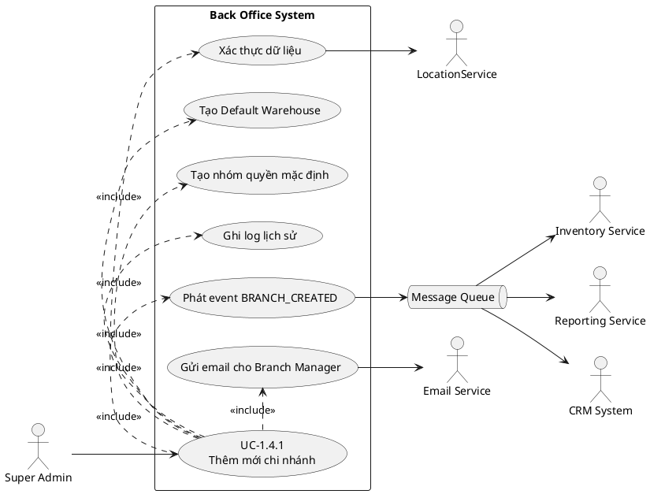

# 1.4.1. Quy Trình Thêm Mới Chi Nhánh

## Mô tả
Khi doanh nghiệp mở rộng và mở thêm cửa hàng mới, Super Admin cần thêm chi nhánh vào hệ thống để bắt đầu vận hành.

---

## Actor & Hệ thống liên quan

### Primary actor
- **Super Admin** (người dùng Back Office)

### Thành phần/hệ thống trong phạm vi Back Office
- Back Office UI
- Branch API/Service
- Validation component
- Branch Database
- Audit/Log Service
- RBAC/Permission Service
- Message Queue/Event Bus

### Hệ thống ngoài (tích hợp)
- LocationService (xác thực địa chỉ)
- Inventory Service (khởi tạo tồn kho)
- Reporting Service (tạo dashboard chi nhánh)
- CRM System (cập nhật danh sách địa điểm)
- Email Service (gửi email cho Branch Manager)

---

## Use case: UC-1.4.1 – Thêm mới chi nhánh

### Mục tiêu
Tạo chi nhánh mới để bắt đầu vận hành, đồng thời khởi tạo các dữ liệu liên quan và đồng bộ sang các hệ thống khác.

### Tiền điều kiện (Pre-conditions)
- Super Admin đã đăng nhập.
- Super Admin có quyền “Quản lý chi nhánh”.
- Danh mục Ward/District/City và dữ liệu nhân viên (manager) tồn tại.

### Hậu điều kiện (Post-conditions) khi thành công
- Tạo Branch với `status = "ACTIVE"`.
- Tạo Default Warehouse cho Branch.
- Tạo nhóm quyền mặc định cho nhân viên chi nhánh.
- Ghi audit log tạo chi nhánh.
- Phát event `BRANCH_CREATED` sang Message Queue để hệ thống khác đồng bộ.
- Gửi email thông báo cho Branch Manager được gán.

---

## Các bước thực hiện (Flow)

1. **Khởi tạo yêu cầu**
   - Super Admin đăng nhập vào Back Office
   - Điều hướng đến menu **"Quản lý chi nhánh"**
   - Chọn nút **"Thêm chi nhánh mới"**
2. **Nhập thông tin chi nhánh**
   - Tên, mã chi nhánh (bắt buộc, duy nhất)
   - Địa chỉ chi tiết, phường/xã, quận/huyện, tỉnh/thành phố
   - Số điện thoại, email (tùy chọn)
   - Giờ mở cửa, đóng cửa
   - Gán người quản lý chi nhánh
   - Múi giờ, đơn vị tiền tệ
3. **Xác thực dữ liệu**
   - Kiểm tra trùng tên/mã
   - Kiểm tra định dạng số điện thoại, email
   - Xác thực địa chỉ qua LocationService
   - Kiểm tra manager_id hợp lệ
4. **Lưu thông tin và tạo dữ liệu liên quan**
   - Lưu branch vào database (status = ACTIVE)
   - Tạo kho hàng mặc định, nhóm quyền mặc định
   - Ghi log lịch sử
5. **Đồng bộ hệ thống liên quan**
   - Gửi event BRANCH_CREATED đến MQ
   - Inventory Service, Reporting Service, CRM System nhận event và xử lý
6. **Thông báo kết quả**
   - Hiển thị thông báo thành công, chuyển hướng chi tiết, gửi email cho Branch Manager

---

## Input / Output

### Input (request body)
```json
{
  "code": "HN_CAU_GIAY_01",
  "name": "POS Hà Nội - Cầu Giấy 01",
  "address_line": "255 Xuân Thủy",
  "ward_id": "W123",
  "district_id": "D456",
  "city_id": "C001",
  "phone": "0988123456",
  "email": "caugiay01@pos.vn",
  "open_time": "08:00",
  "close_time": "22:00",
  "manager_id": 50,
  "currency": "VND",
  "timezone": "Asia/Ho_Chi_Minh"
}
```

### Output thành công (Happy path)
```json
{
  "success": true,
  "data": {
    "id": 101,
    "code": "HN_CAU_GIAY_01",
    "name": "POS Hà Nội - Cầu Giấy 01",
    "status": "ACTIVE",
    "default_warehouse_id": 301,
    "created_at": "2026-02-24T09:00:00Z",
    "created_by": 1
  },
  "message": "Thêm mới chi nhánh thành công"
}
```

### Các trường hợp lỗi phổ biến
- Trùng tên/mã chi nhánh
- Sai định dạng phone/email
- Địa chỉ không hợp lệ
- manager_id không tồn tại hoặc đã được gán

---

## Sơ đồ Use Case (PlantUML)


---

## Sơ đồ trình tự (Sequence Diagram - Happy Path)
```plantuml
@startuml
autonumber
actor "Super Admin" as SA
boundary "Back Office UI" as UI
control "Branch API/Service" as BranchSvc
control "Validation" as Val
entity "Branch DB" as DB
control "LocationService" as LocSvc
control "Warehouse Service" as WhSvc
control "RBAC/Permission Service" as RbacSvc
control "Audit Log Service" as AuditSvc
queue "Message Queue" as MQ
control "Inventory Service" as InvSvc
control "Reporting Service" as RepSvc
control "CRM System" as CrmSvc
control "Email Service" as EmailSvc
SA -> UI : Mở "Quản lý chi nhánh"\nChọn "Thêm chi nhánh mới"
UI -> BranchSvc : POST /branches (input JSON)
BranchSvc -> Val : Validate required fields\n+ phone/email format\n+ open/close time
Val --> BranchSvc : OK
BranchSvc -> DB : Check unique(name, code)
DB --> BranchSvc : Not exists
BranchSvc -> LocSvc : Validate address(ward_id,\ndistrict_id, city_id, address_line)
LocSvc --> BranchSvc : Address valid
BranchSvc -> DB : Check manager_id exists\nand not assigned
DB --> BranchSvc : OK
BranchSvc -> DB : Insert Branch(status=ACTIVE)\nreturn branch_id
DB --> BranchSvc : branch_id=101
BranchSvc -> WhSvc : Create default warehouse(branch_id=101)
WhSvc --> BranchSvc : default_warehouse_id=301
BranchSvc -> RbacSvc : Create default roles/groups\nfor branch_id=101
RbacSvc --> BranchSvc : OK
BranchSvc -> AuditSvc : Write audit log\n(BRANCH_CREATED by created_by)
AuditSvc --> BranchSvc : OK
BranchSvc -> MQ : Publish event BRANCH_CREATED\n(branch_id=101, warehouse_id=301)
MQ --> BranchSvc : ACK
par Async consumers
  MQ -> InvSvc : BRANCH_CREATED
  InvSvc --> MQ : ACK (init inventory)
and
  MQ -> RepSvc : BRANCH_CREATED
  RepSvc --> MQ : ACK (create dashboard)
and
  MQ -> CrmSvc : BRANCH_CREATED
  CrmSvc --> MQ : ACK (update location list)
end
BranchSvc -> EmailSvc : Send email to Branch Manager\n(manager_id=50)
EmailSvc --> BranchSvc : Accepted
BranchSvc --> UI : 200 OK (success=true + data)
UI --> SA : Thông báo thành công\n+ chuyển trang chi tiết
@enduml
```

---

## Lưu ý triển khai
- Chuẩn hóa lỗi trả về, highlight đúng field trên UI
- Hỗ trợ Idempotency-Key cho POST tránh tạo trùng
- DB cần unique index code, name để chống race khi tạo đồng thời
